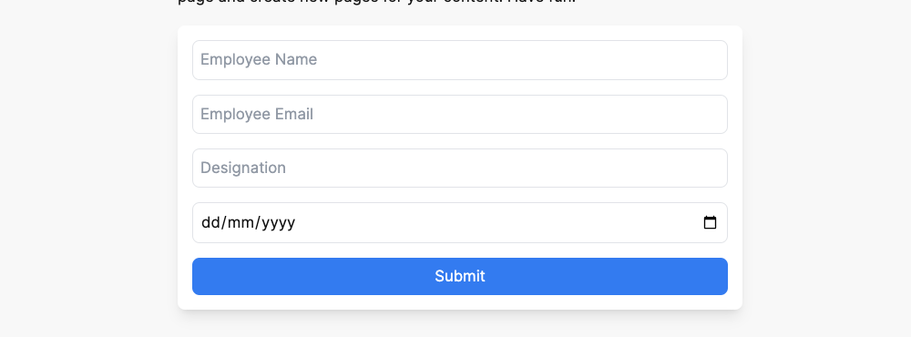
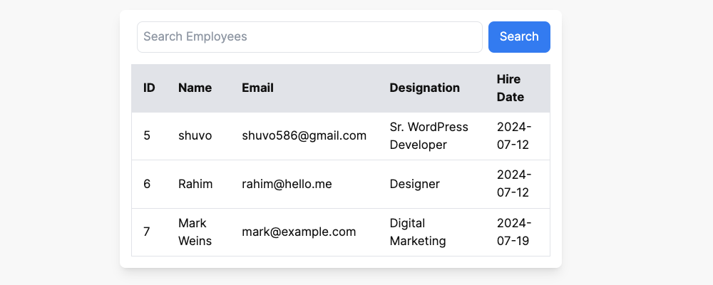
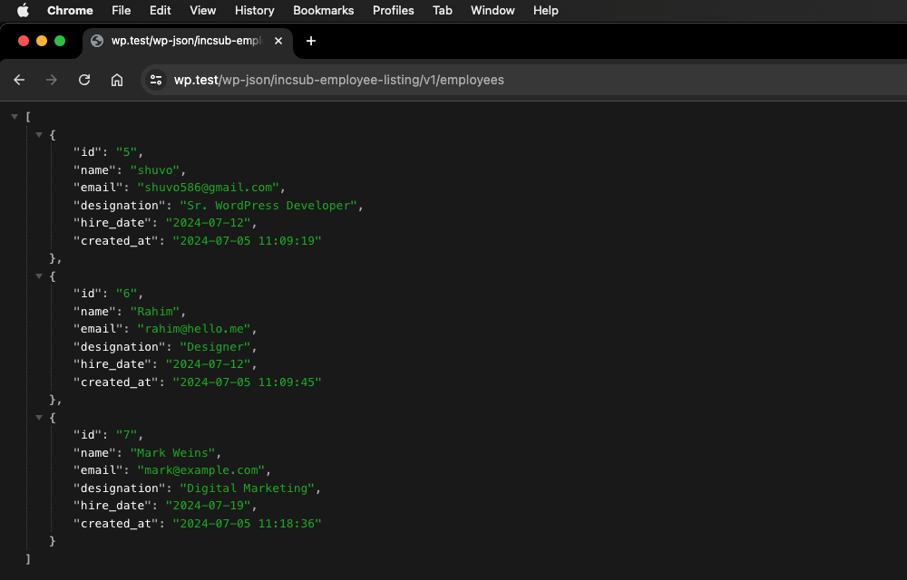
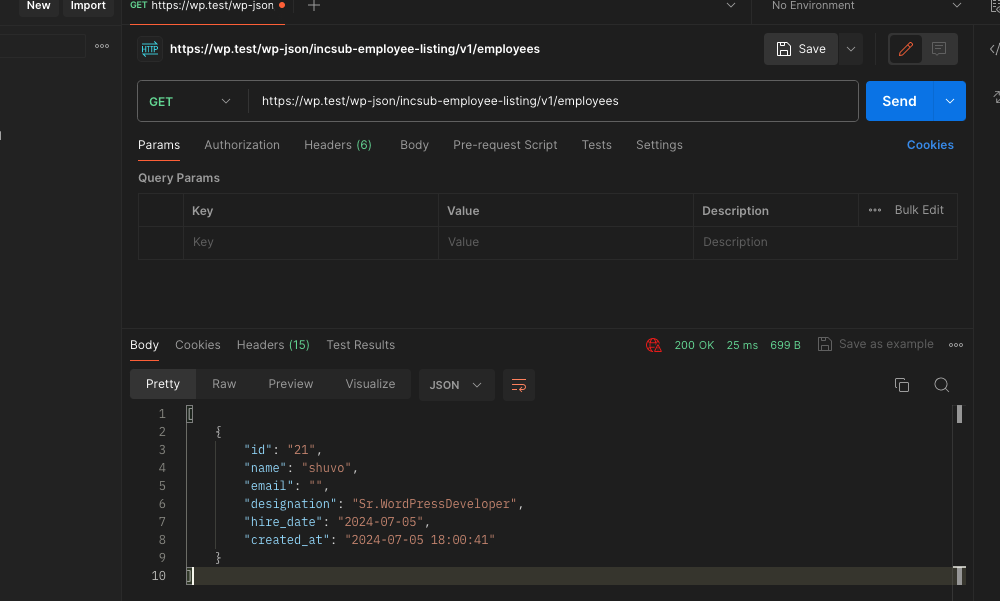
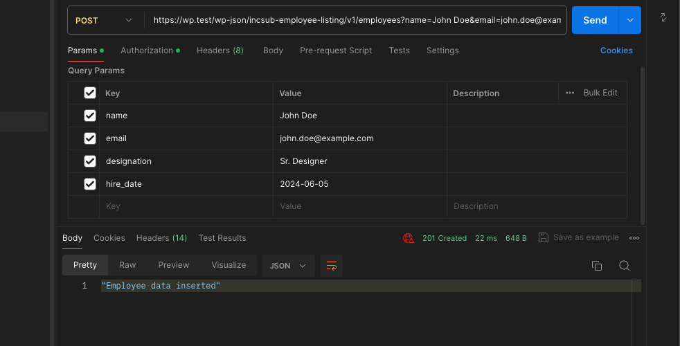
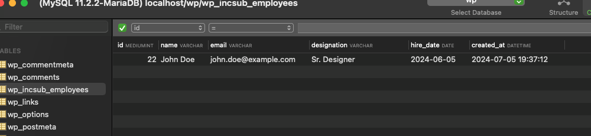

# Employee Listing
It is a simple employee listing plugin

## Install
- Download the plugin into your plugins directory 
- Enable in the WordPress admin

## Requirements
- Run `yarn install` *Requires node 18.12.0 or newer version*
- Run `composer install` for detailed WordPress Coding Standards packages. as this plugin is zipped with only **autoloader**
- Run 'composer phpcs' for scanning coding standards issues.

## Screenshots

